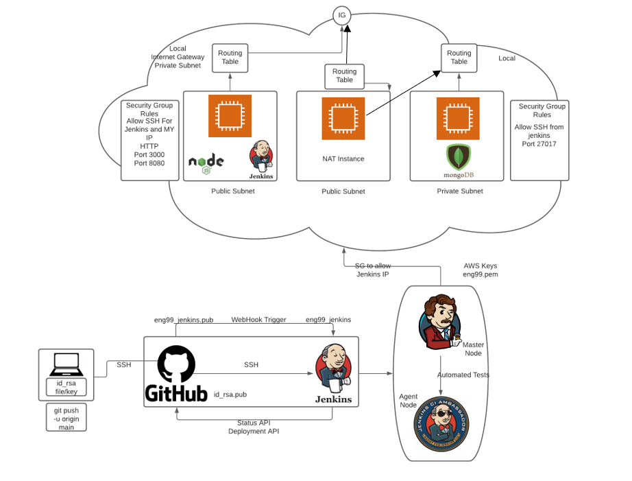
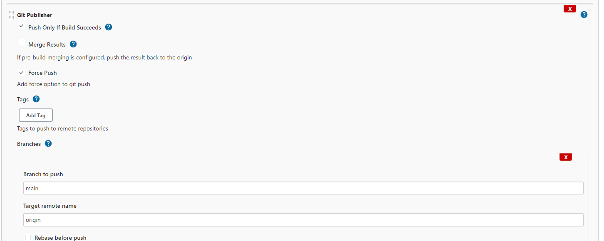

# VPC and CICD Task

## Diagram

## SetUp Jenkins EC2
- Install Java and JDK, [click here for Java installation guide](https://www.digitalocean.com/community/tutorials/how-to-install-java-with-apt-on-ubuntu-18-04#installing-specific-versions-of-openjdk)
- Install Jenkins and dependencies, [click here for Jenkins installation guide](https://www.digitalocean.com/community/tutorials/how-to-install-jenkins-on-ubuntu-18-04) 
- Set up Jenkins within EC2 instance and then enter Jenkins using EC2 Instance, `http://publicIP:8080`
- Install Git and NodeJS plugins within Jenkins.
- After installing NodeJS, configure global tools and give nodajs a name and select said node within the build. 

## GitHub
- Add Jenkins IP to WebHook of the github repo 

## NAT Instance SetUp 
- NAT instance needs to be configured to use provisioning file within Database EC2.
- NAT instance requires inbound and outbound security groups to allow traffic from the DB instance. 
- SSH into NAT instance, then SSH into DB instance.

## Jenkins NPM Test
- Start the pipeline with a test build to ensure any changes made to the repo passes the built in tests for the application. 
- Once this build passes, move on to the next build. 
- The automated tests should be carried out in a agent node EC2 rather than the master node as the tests could potentially cause crashes so it is good practice to use agent node. 

## Jenkins Merge
- Link git URL to merge build
- Trigger Git Publisher to merge dev branch to the main branch. 

## App SetUp

- App instance up and running and jenkins build can initialise app to be viewed on web browser using the app EC2 instance IP, reverse proxy removes the need to enter `IP:3000`. 

## DB SetUp

- After running pm2 start app.js on console, the /posts web page loads the database. 
