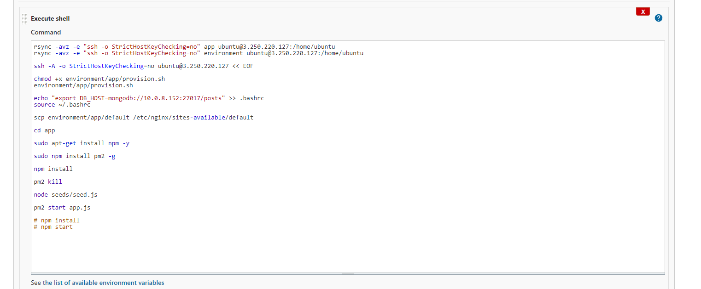
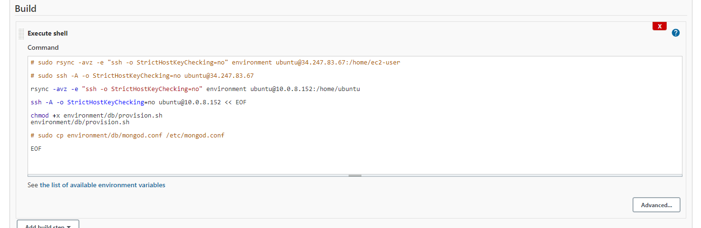

# VPC and CICD Task

## Diagram

## SetUp Jenkins EC2
- Install Jenkins and dependencies
- Install Java 
- Set up Jenkins within EC2 instance and then enter Jenkins using EC2 Instance, `http://publicIP:8080`

## App SetUp

- App instance up and running and jenkins build can initialise app to be viewed on web browser on port 3000. 

## DB SetUp

- Struggling to connect db to the app in order to see the /posts web page, all I can see is the cannot GET /posts. Most likely an error with SG and private subnet. Should also double check mongod env var. 
