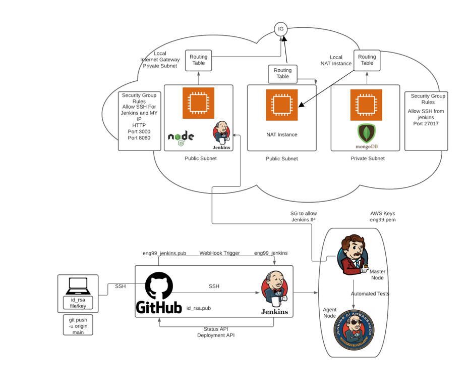

# VPC and CICD Task

## Diagram

## SetUp Jenkins EC2
- Install Jenkins and dependencies
- Install Java 
- Set up Jenkins within EC2 instance and then enter Jenkins using EC2 Instance, `http://publicIP:8080`
- After installing nodejs, configure global tools and give nodajs a name and select said node within the build. 

## App SetUp

- App instance up and running and jenkins build can initialise app to be viewed on web browser on port 3000. 

## DB SetUp

- After running pm2 start app.js on console, the /posts web page loads the database. 
